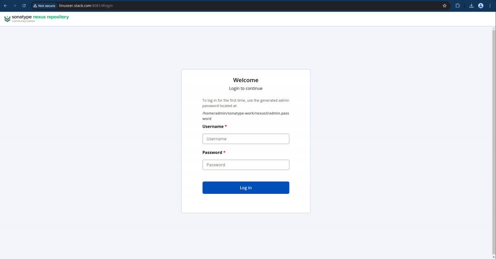
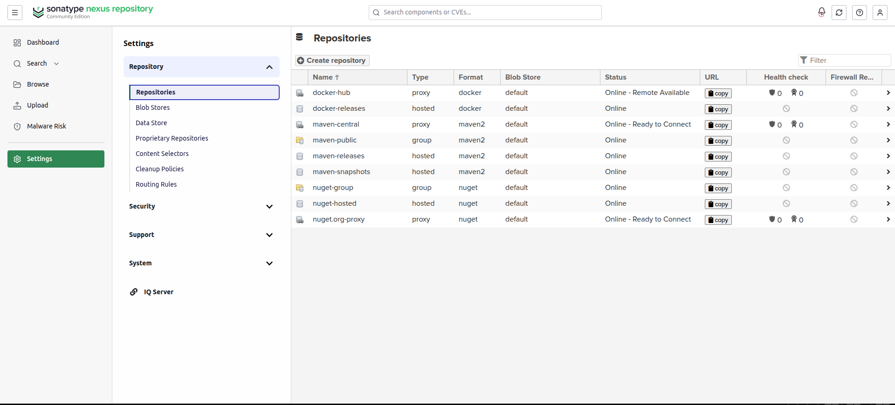
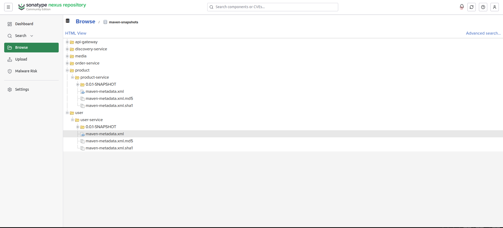
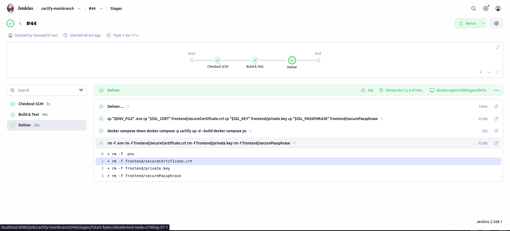

# Sonatype Nexus Repository Manager

This folder contains the configuration and setup instructions for **Sonatype Nexus 3**, used in the **Cartify** microservices architecture for artifact management and proxy caching.

---

## 📌 Table of Contents
- [What is Nexus?](#-what-is-nexus)
- [Setup & Configuration](#-setup--configuration)
  - [Prerequisites](#prerequisites)
  - [Docker Compose Setup](#docker-compose-setup)
  - [First-Time Access & Password Retrieval](#first-time-access--password-retrieval)
  - [Repository Configuration](#repository-configuration)
- [CI/CD Pipeline Integration](#-cicd-pipeline-integration)
  - [Maven distributionManagement Setup](#maven-distributionmanagement-setup)
  - [Automated Deployment Script](#automated-deployment-script)
  - [Jenkinsfile Workflow](#jenkinsfile-workflow)
- [🖼️ Screenshot Gallery](#%EF%B8%8F-screenshot-gallery)

---

## 🚀 What is Nexus?

**Sonatype Nexus Repository Manager** is a centralized repository management system. In the Cartify microservices application, Nexus serves two key roles:

1. **Maven Artifact Repository:** Stores built Java artifacts (JAR files) across snapshot and release versions for services (`api-gateway`, `discovery-service`, `product-service`, `user-service`, `order-service`, and `media-service`).
2. **Container Registry / Proxy (Optional):** Acts as a proxy/cache for Docker Hub images (e.g., MongoDB, Kafka) to accelerate container deployments and bypass rate limits.

---

## ⚙️ Setup & Configuration

### Prerequisites
Ensure the external Docker network `ci-net` is created before starting the service:
```bash
docker network create ci-net
```

### Docker Compose Setup
Nexus is configured via `docker-compose.yaml` inside the `nexus/` directory:

```yaml
services:
  nexus:
    image: sonatype/nexus3
    volumes:
      - "nexus-data:/nexus-data"
    ports:
      - "8081:8081"
    networks:
      - ci-net

networks:
  ci-net:
    external: true

volumes:
  nexus-data:
```

To launch Nexus:
```bash
cd nexus
docker compose up -d
```

---

### First-Time Access & Password Retrieval

1. Open your browser and navigate to: `http://localhost:8081`
2. Click **Sign In** in the upper-right corner.
3. Retrieve the generated admin password from the volume/container:
   ```bash
   docker exec -it nexus-nexus-1 cat /nexus-data/admin.password
   ```
4. Follow the setup wizard to change the password and enable anonymous access if desired.



---

### Repository Configuration

Ensure the following repositories are configured in Nexus:
- **`maven-releases`** (Hosted, Release deployment policy)
- **`maven-snapshots`** (Hosted, Snapshot deployment policy)
- **`maven-public`** (Group repository combining releases, snapshots, and Maven central)



---

## 🔄 CI/CD Pipeline Integration

### Maven distributionManagement Setup
Each microservice in the Cartify repository configures Nexus as its target deployment repository in `pom.xml`:

```xml
<properties>
    <nexus-url>http://${NEXUS_HOST}:8081</nexus-url>
</properties>

<distributionManagement>
    <repository>
        <id>nexus</id>
        <url>${nexus-url}/repository/maven-releases/</url>
    </repository>
    <snapshotRepository>
        <id>nexus</id>
        <url>${nexus-url}/repository/maven-snapshots/</url>
    </snapshotRepository>
</distributionManagement>
```

---

### Automated Deployment Script

The bash script [`scripts/deploy_to_nexus.sh`](../scripts/deploy_to_nexus.sh) iterates through all microservices and deploys their artifacts to Nexus:

```bash
# Deploys all services using Maven Wrapper
./mvnw clean deploy -DNEXUS_HOST=nexus
```

---

### Jenkinsfile Workflow

The Jenkins CI/CD pipeline triggers the deployment stage automatically:

```groovy
pipeline {
    agent {
        node {
            label 'docker-agent'
        }
    }

    stages {
        stage('Build & Test') {
            steps {
                echo 'Building..'
                sh './scripts/deploy_to_nexus.sh'
            }
        }
    }
}
```

---

## 🖼️ Screenshot Gallery

### 1. Nexus Initial Login Page


---

### 2. Configured Repositories View


---

### 3. Deployed Microservices Artifacts 


---

### 4. Jenkins CI/CD Pipeline Execution

